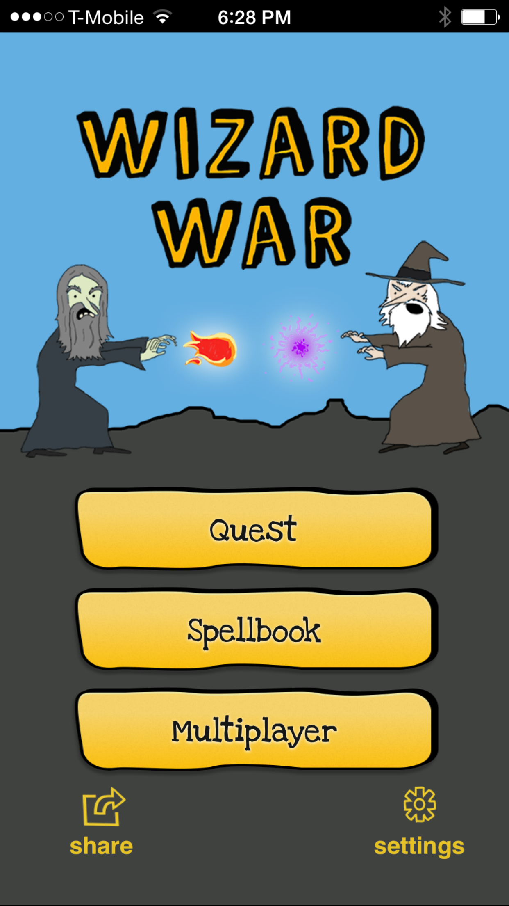
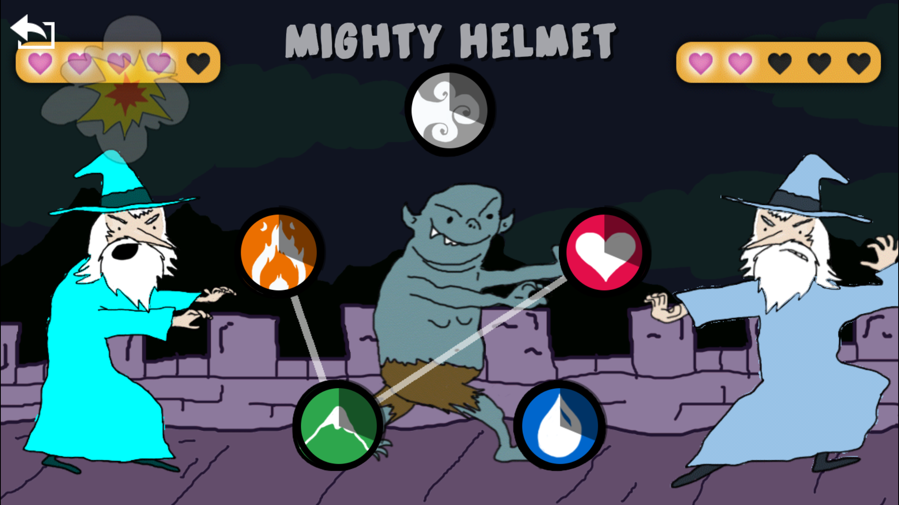
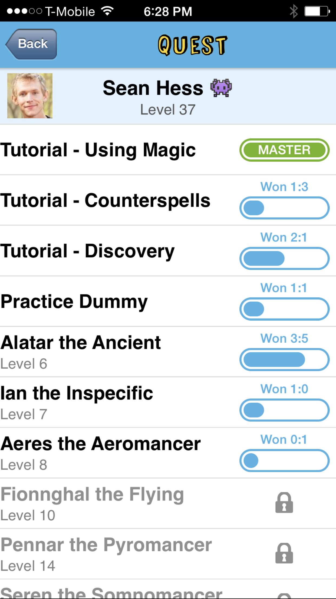

About Me
========

I create well-crafted applications to solve business problems. I've worked professionally in software and startups since 1999, and have a consistent track record of delivering quality solutions ahead of schedule.

[Please visit LinkedIn for my work history and recommendations](https://www.linkedin.com/in/seanhess)

I.TV
-----------------------------------------------------------------

I was Cofounder and CTO of I.TV from 2009-2012. [Read more on LinkedIn](https://www.linkedin.com/in/seanhess#experience-101774237)

We created the best interactive TV Guide in the iOS app store. The timetable was highly optimized and silky smooth on older devices.

<iframe width="560" height="315" src="https://www.youtube.com/embed/I4EXlmRrHT4" frameborder="0" allowfullscreen></iframe>

Wizard War
----------

We won Startup Weekend SLC with this multiplayer iOS game. I wanted to create a mobile game that brought people together on a couch or around a table. Wizard War allows two players to face off in a wizard duel combining action, reflexes, and elements of rock-paper-scissors. I spent several months after the event getting it ready for release. It's moderately popular among young people.

It's [Open Source](https://github.com/seanhess/wizardwar#wizard-war), written in Objective-C, and leverages Firebase, Reactive Cocoa.

Available for free in the [App Store](http://appstore.com/wizardwar)

Players create spells by combining elements in specific patterns. These spells counter each other like Paper Rock Scissors.

In addition to the Multiplayer there are a series of Quests against increasingly difficult opponents.

